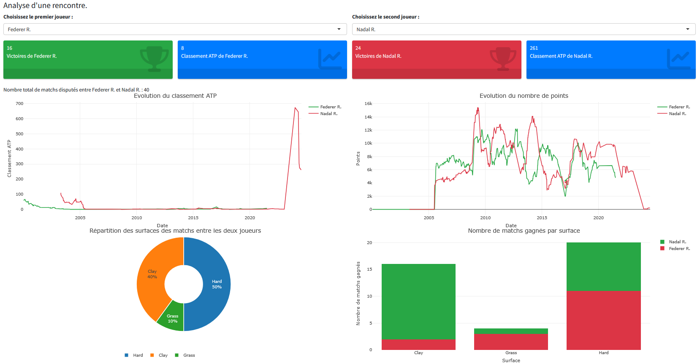
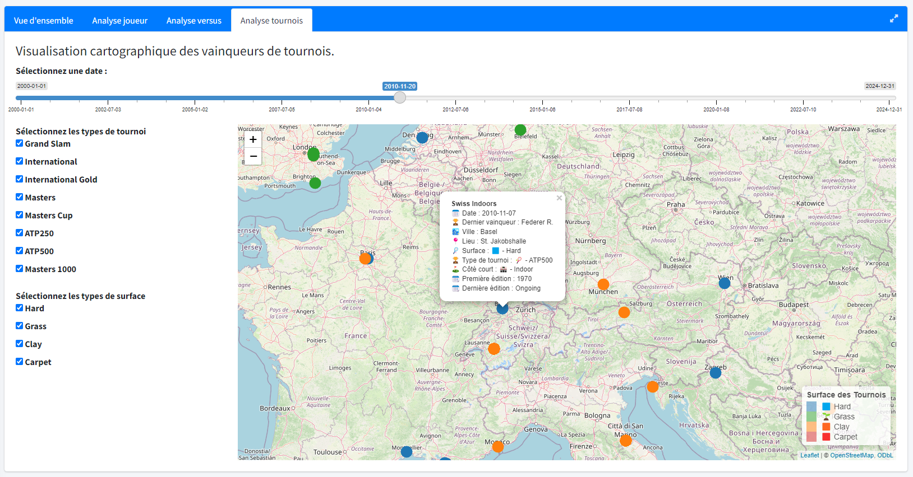
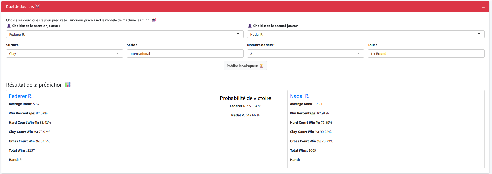

# Plongez au cœur du tennis avec notre dashboard de data visualisation !

Le tennis est un sport de passion, de stratégie et de performances pourtant l’analyse approfondie des données du circuit ATP reste rare. C'est pourquoi nous avons décidé de créer une application interactive qui met en lumière les tendances, les performances et les dynamiques du tennis professionnel.

Vous retrouverez l'application à l'adresse : [Lien vers l'application](https://elliotrm.shinyapps.io/TennisDashboard/)

Vous pouvez aussi accéder au lien du projet GitHub : [Lien vers GitHub](https://github.com/ziraax/Shiny-ATP500Dashboard)

## **Une base de données riche**

Notre projet s’appuie sur un jeu de données vaste, rassemblant **64 411 matchs** entre joueurs du circuit ATP sur la période 2000-2025. Pour chaque rencontre, nous avons collecté des informations clés : le tournoi, la date, la surface (terre battue, gazon, dur…), les joueurs, le vainqueur, le score, le classement ATP et bien plus encore.

Afin d'enrichir l'analyse, nous avons ajouté des détails sur les joueurs (nationalité, main dominante, date de naissance) et les tournois (coordonnées GPS, catégorie). Ces données nous ont permis d'analyser le circuit ATP sous toutes ses formes :

-   Analyser les performances d'un joueur

-   Analyser les rencontres entre deux joueurs

-   Un modèle de prédiction de duel à découvrir dans l'onglet "Battle"

-   Visualiser les tournois de manière interactive sur une carte temporelle

-   Un modèle de clustering non-supervisé (k-means) pour visualiser les différences entre les "classes" de joueurs présupposées

## Découverte de l'application

Dès l’ouverture de l'application, une **page d'accueil immersive** donne un premier aperçu de la base de données :

-   **Le nombre total de matchs enregistrés**

-   **Le nombre de joueurs uniques**

-   **La période couverte par les données**

Notre application se divise ensuite en **trois grandes sections**, chacune offrant une approche unique de l'analyse du tennis.

## **A - Le Dashboard : une immersion dans les statistiques du tennis**

### **1. Vue d'ensemble : un panorama du circuit ATP**

Pour commencer, notre vue d’ensemble donne accès à des **statistiques générales**, telles que :

-   **Le nombre total de matchs joués**

-   **Le nombre de vainqueurs uniques** (tous les joueurs n’ont pas eu la chance de soulever un trophée !)

-   **Le nombre de tournois organisés à travers le monde**

On observe rapidement une forte prédominance des matchs sur **surface dure et terre battue**, alors que le gazon et la moquette restent plus rares. Un classement des joueurs les plus victorieux est aussi disponible, mettant en avant les légendes du tennis comme **Novak Djokovic, Roger Federer, Andy Murray et Rafael Nadal**.

Nous proposons également une analyse des **tendances annuelles**, illustrant l'impact du Covid-19 en 2020 sur le circuit ATP, avec une chute brutale du nombre de matchs et de tournois disputés.

### **2. Analyse joueur : zoom sur une carrière**

Que vous soyez fan d'un joueur en particulier ou curieux de comparer des parcours, cette section permet via un simple menu déroulant d'explorer la carrière d'un joueur et d'obtenir son **profil en détail** :

-   Nationalité, main dominante, classement actuel

-   Nombre de matchs joués et pourcentage de victoires par surface

-   Participation et victoires aux tournois majeurs (Grand Chelems, Masters 1000, etc.)

### **3. Analyse Versus : qui domine qui ?**

Ici, on peut comparer directement **deux joueurs** pour analyser leur rivalité :

-   Nombre de victoires de chacun, classement actuel

-   Evolution du classement ATP

-   Distribution des matchs joués par surface

-   Nombre de matchs gagnés par surface, par joueur

Les spécialistes des surfaces y trouveront des résultats fascinants : **Rafael Nadal roi de la terre battue, Novak Djokovic maître du dur**...

### **4. Analyse des tournois : le tennis autour du globe**

Cette section propose une **carte interactive** de tous les tournois ATP. Avec un sélecteur de date et de type de tournoi, on peut visualiser chaque compétition, classée par couleur en fonction de la surface. En cliquant sur un tournoi, un pop-up affiche ses informations clés, notamment **le vainqueur de l'année en question**. Des selecteurs à gauche vous permettent d'affiner votre recherche.

## **B - Clustering : segmentation des joueurs**

Dans cette partie, nous avons exploité le **clustering via la méthode k-means** pour regrouper les joueurs selon leurs performances.

L’utilisateur peut :

-   Définir **le nombre de clusters**

-   Sélectionner les **variables** pour représenter les joueurs clusterisés

Cela permet d’identifier des groupes homogènes : les **légendes du Big Four**, les joueurs de **top 10 à 50**, les outsiders... Une approche visuelle et puissante pour comprendre la hiérarchie du tennis mondial.

Nous avons aussi réaliser une ACP qui est une méthode de réduction de dimension pour pouvoir proposer une visualisation complète sur 2 et 3 axes (composantes principales).

Enfin, vous trouverez un onglet "Explications sur le clustering" qui traite notamment de la question du choix du paramètre k optimal dans le cas du clustering non supervisé.

*L'affichage peut prendre jusqu'à 10 secondes.*

## **C - Battle : prédictions de rencontres**

En sélectionnant **deux joueurs**, l'application estime **la probabilité de victoire de chacun** grâce à un modèle de régression logistique. L'outil propose de choisir le **contexte** du match c'est à dire la surface sur laquelle il est joué, la série, le nombre de sets, et l'étape du tournoi.

*Vous trouverez un onglet "Explications sur notre modèle" pour en savoir plus sur la modélisation.*

L'outil idéal pour anticiper **le résultat d'un match.**

Enfin, vous trouverez un onglet "Simulation de tournoi" qui permet de simuler un arbre de tournoi (à partir des quarts de final).

## **Conclusion**

A travers ce projet, nous avons pu découvrir en profondeur la visualisation de données avec R Shiny. La mise en place de méthodes de gestion de projet, notamment Github, nous a permis de réaliser l'application dans les temps. De plus nous avons eu la chance de se voir pour évoquer les différentes fonctionnalités que nous voulions mettre en place.

Notre application ne se contente pas de présenter des chiffres : elle raconte une histoire, celle des joueurs, des tournois et des affrontements qui ont marqué l'histoire du tennis. Que vous soyez analyste, fan ou simple curieux, ce dashboard vous offre une vision globale de l’univers du tennis professionnel.

Cependant, avec plus de temps nous aurions pu développer de meilleurs modèles et les tester de manière plus rigoureuse. De plus, dans le temps imparti nous devions faire des choix dans ce que nous voulions représenter mais nous aurions pu explorer d'autres pistes de visualisations.

Avec des outils puissants comme le clustering, les prédictions de duel et les cartes interactives, nous vous invitons à naviguer à travers les données et à découvrir des insights précieux sur ce sport.

Accédez à l’application dès maintenant : [Lien vers l'application](https://elliotrm.shinyapps.io/TennisDashboard/)
